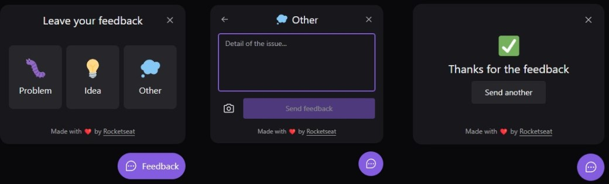

# Feedback

## Tech used:

- **Frontend**: [Vite](https://vitejs.dev/)
- **Lib**: [React](https://reactjs.org/) & [Typescript](https://www.typescriptlang.org/)
- **Icons**: [Phosphor-react](https://phosphoricons.com/)
- **UI Components**: [HeadlessUI](https://headlessui.com/)
- **Styling**: [Tailwind CSS](https://tailwindcss.com/)
- **Deployment**: [Vercel](https://vercel.com)

## Screenshots



## Overview

This project was developed in the [Rocketseat](https://www.rocketseat.com.br/) Next Level Week Return.
The application allows you to leave feedback from web and also have a [mobile](https://github.com/msdevpt/nlw-return-impulse-mobile) version and [server](https://github.com/msdevpt/nlw-return-impulse-server) needed for both versions.

## Running Locally

This application requires Node.js v18+.

```bash
$ git clone https://github.com/msdevpt/nlw-return-impulse-web.git
$ cd nlw-return-impulse-web
$ npm i
$ npm run dev
```

Create a `.env.local` file similar to [`.env.local.example`](https://github.com/msdevpt/nlw-return-impulse-web/blob/main/.env.local.example).

## Credits

- [Rocketseat](https://www.rocketseat.com.br/) 
- [Design](https://www.figma.com/file/gI2bEhIGwT1tT3Tbr5tEwG/Feedback-Widget-Community)